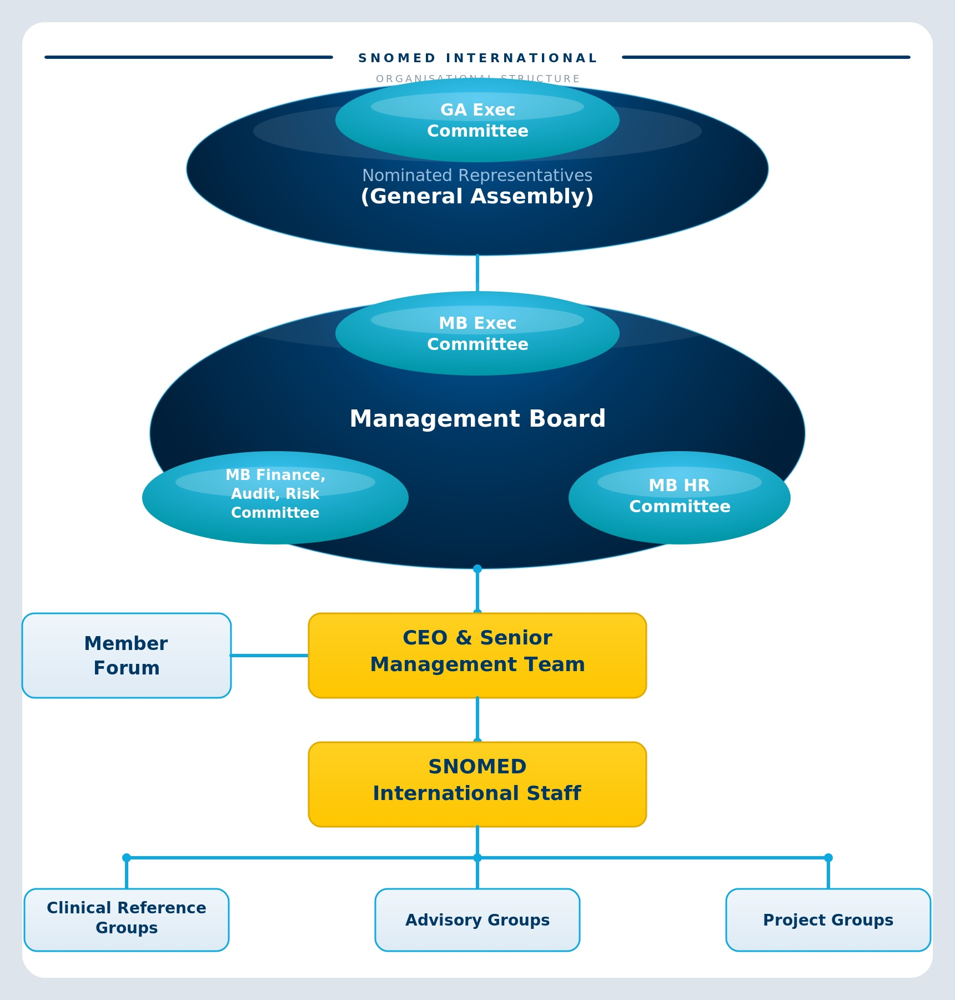

# Governance Structure

SNOMED International operates through a governance structure that includes the General Assembly, Management Board, and advisory groups. This model ensures that Member countries guide the organisation’s strategy and priorities.


**Learn more**

[Governance overview](https://www.snomed.org/governance-and-advisory)


***

#### Key governance bodies include:

**General Assembly (GA):** The General Assembly is the highest decision-making body of SNOMED International. Each Member country appoints a representative who participates in governance decisions, including strategy approval and major organisational policies.

**Management Board (MB):** The Management Board is the elected governance body responsible for overseeing the organisation between General Assembly meetings. It ensures that strategic decisions approved by the GA are implemented.

**Advisory and Collaboration Groups:** Several advisory and collaboration groups support the organisation by providing expert guidance and Member perspectives. These include groups such as the Member Forum, Clinical Advisory Group, and Editorial Advisory Group.

Together, these bodies support transparent governance and ensure that the organisation reflects the needs and priorities of its global Member community.

<figure><figcaption></figcaption></figure>

<a href="https://docs.google.com/forms/d/e/1FAIpQLScTmbZIf0UEQwYDkY27EEWBkaiYkHSbR0_9DmFrMLXoQLyL7Q/viewform?usp=pp_url&entry.1767247133=snomed-governance-advisory-guide&entry.670899847=Governance%20Structure" class="button primary">Provide Feedback</a>
